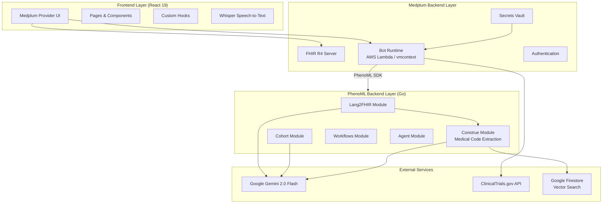
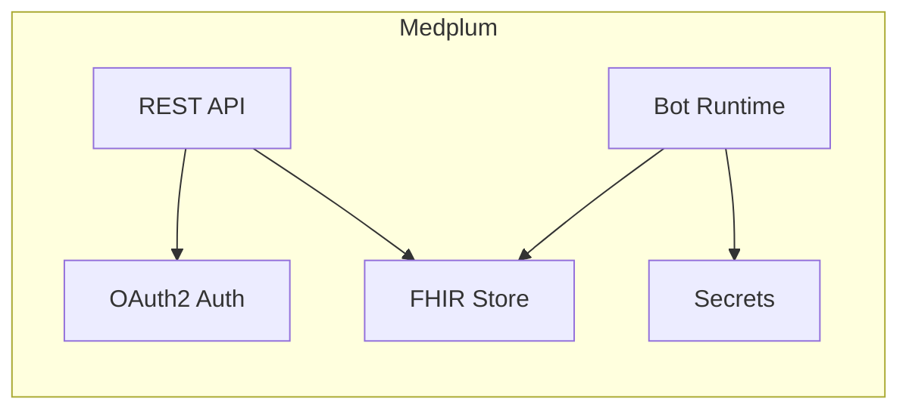
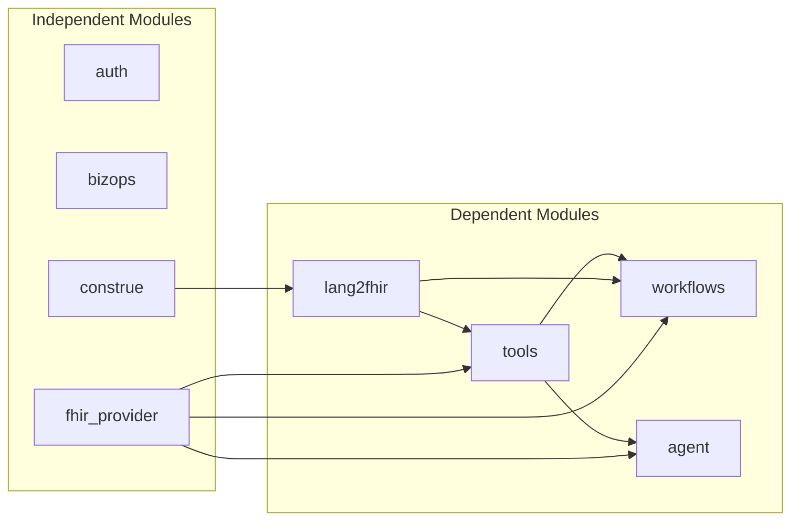
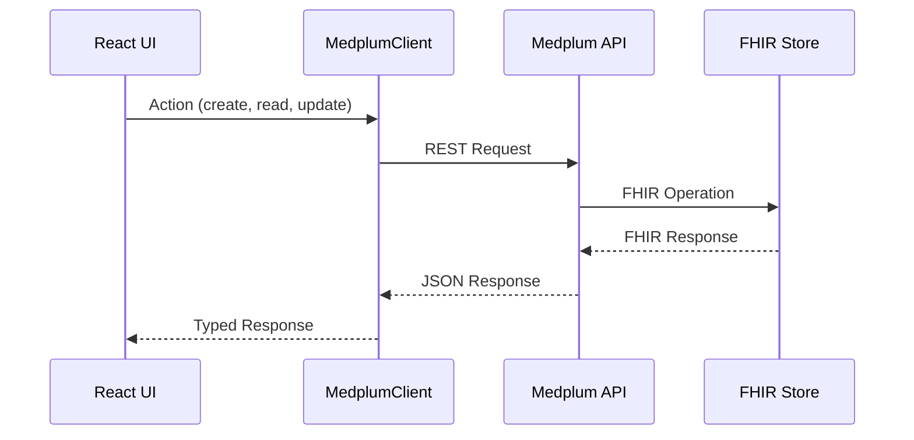
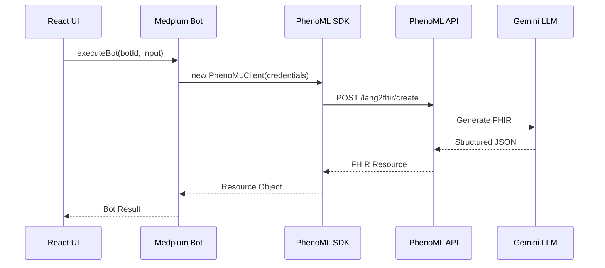
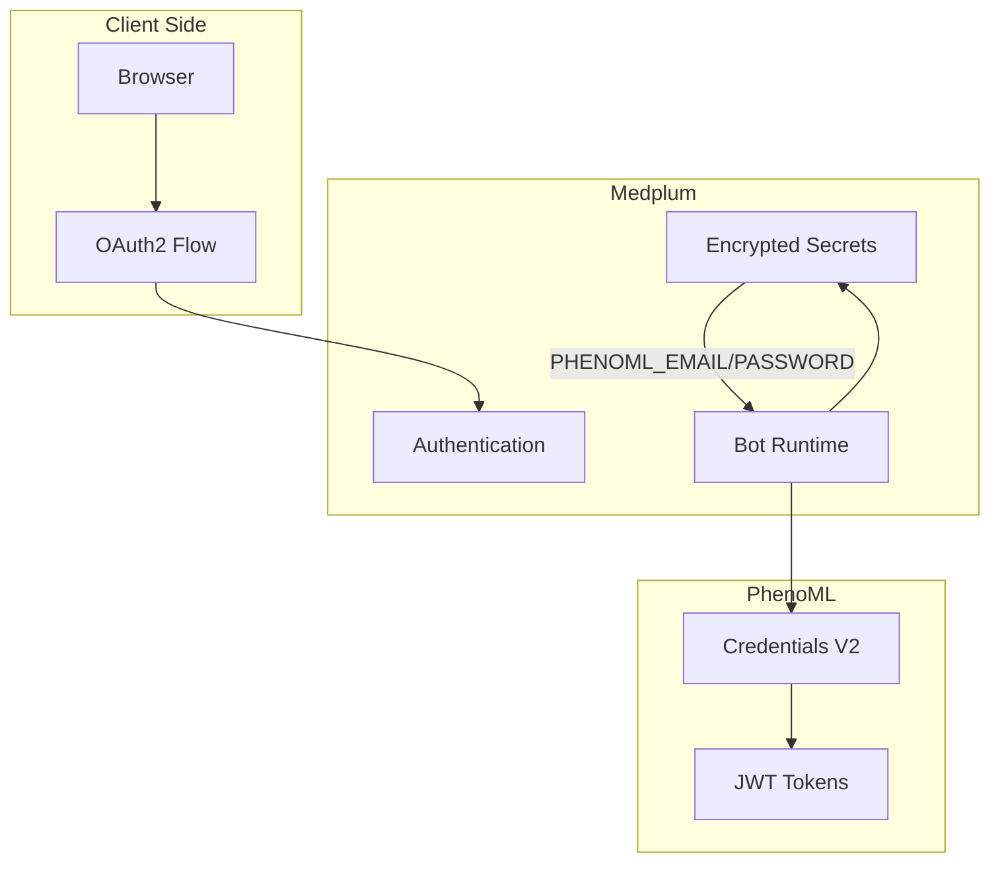

# System Architecture

Comprehensive architecture documentation for the Medplum Provider with Lang2FHIR application.

## High-Level Architecture



## Four-Layer Architecture

### Layer 1: Frontend (React)

**Technology Stack:**
- React 19.1.1
- Vite 7.1.1 (build tool)
- Mantine 7.17.8 (UI components)
- React Router 7.8.0 (routing)
- TypeScript 5.8.3

**Key Components:**

| Component | Purpose |
|-----------|---------|
| `HomePage` | Dashboard with quick actions |
| `PatientSearchPage` | Patient lookup and selection |
| `PatientPage` | Patient timeline, conditions, meds |
| `EncounterChart` | SOAP note charting with auto-save |
| `ResourceLang2FHIRCreatePage` | AI-powered resource creation |
| `CreateCohortPage` | Natural language cohort builder |
| `ClinicalTrialsTab` | Trial finder with AI analysis |

**Custom Hooks:**

| Hook | Purpose |
|------|---------|
| `usePatient()` | Fetch and cache patient context |
| `useEncounter()` | Fetch encounter by URL param |
| `useEncounterChart()` | Complex encounter + related resources |
| `useDebouncedUpdateResource()` | Debounced FHIR updates (100ms) |

### Layer 2: Medplum Backend

**Role:** FHIR R4 compliant data store and bot runtime

**Components:**



**Bot Runtime Options:**
- `awslambda` - AWS Lambda (production/hosted Medplum)
- `vmcontext` - Node.js VM (local development)

### Layer 3: PhenoML Backend

**Technology:** Go-based platform on PocketBase

**Module Architecture:**



**Module Descriptions:**

| Module | Purpose |
|--------|---------|
| `auth` | Authentication (Auth0, CredentialsV2, PocketBase) |
| `construe` | Medical code extraction (SNOMED, LOINC, RxNorm, ICD-10) |
| `lang2fhir` | Natural language to FHIR conversion |
| `tools` | LLM tool orchestration & MCP integration |
| `workflows` | Workflow engine for complex operations |
| `agent` | AI agent services |
| `fhir_provider` | FHIR server configuration management |

### Layer 4: External Services

| Service | Purpose |
|---------|---------|
| **Google Gemini 2.0 Flash** | LLM for text understanding and FHIR generation |
| **Google Firestore** | Vector search for medical code extraction |
| **ClinicalTrials.gov** | Clinical trial search API |

## FHIR Resources

### Core Clinical Resources

| Resource | Usage |
|----------|-------|
| `Patient` | Patient demographics |
| `Practitioner` | Healthcare providers |
| `Encounter` | Patient visits/appointments |
| `Condition` | Diagnoses and problems |
| `Observation` | Clinical observations (vitals, labs) |
| `Procedure` | Clinical procedures |
| `MedicationRequest` | Medication orders |
| `CarePlan` | Care plans |

### Workflow Resources

| Resource | Usage |
|----------|-------|
| `Task` | Clinical tasks and todos |
| `Communication` | Messages and notes |
| `Appointment` | Scheduled appointments |
| `Slot` | Available time slots |

### Document Resources

| Resource | Usage |
|----------|-------|
| `DocumentReference` | Uploaded documents |
| `Questionnaire` | Form definitions |
| `QuestionnaireResponse` | Form responses |
| `Binary` | Raw file content |

### Research Resources

| Resource | Usage |
|----------|-------|
| `Group` | Patient cohorts |
| `ResearchStudy` | Clinical trials |

## Component Interaction

### Frontend to Medplum



### Bot Execution Flow



## Technology Stack Summary

| Category | Technology | Version |
|----------|------------|---------|
| **UI Framework** | React | 19.1.1 |
| **Build Tool** | Vite | 7.1.1 |
| **Component Library** | Mantine | 7.17.8 |
| **Routing** | React Router | 7.8.0 |
| **FHIR Client** | @medplum/react | 4.3.10 |
| **Language** | TypeScript | 5.8.3 |
| **Testing** | Vitest | 3.2.4 |
| **PhenoML SDK** | phenoml | 0.0.20 |
| **Speech-to-Text** | @xenova/transformers | Browser-local Whisper |

## Configuration Files

| File | Purpose |
|------|---------|
| `package.json` | Dependencies and scripts |
| `tsconfig.json` | Main TypeScript config (ESNext modules) |
| `tsconfig-bots.json` | Bot TypeScript config (CommonJS) |
| `vite.config.ts` | Vite build configuration |
| `.eslintrc.cjs` | ESLint rules |

## Security Architecture



**Security Layers:**

1. **User Authentication** - OAuth2 via Medplum
2. **Secrets Management** - Credentials stored in Medplum's encrypted vault
3. **Bot Isolation** - Bots run in isolated Lambda/VM contexts
4. **API Authentication** - PhenoML uses credential-based auth with JWT tokens
5. **HTTPS** - All communication encrypted in transit

## Deployment Architecture

### Local Development

```
localhost:3000 (Vite Dev Server)
    ↓
localhost:8103 (Local Medplum) [optional]
    ↓
experiment.app.pheno.ml (PhenoML API)
```

### Production

```
Your Domain (React SPA)
    ↓
app.medplum.com (Hosted Medplum)
    ↓
app.pheno.ml (PhenoML Production)
```

## Related Documentation

- [LOCAL_SETUP.md](./LOCAL_SETUP.md) - Setup instructions
- [PHENOML_INTEGRATION.md](./PHENOML_INTEGRATION.md) - Integration details
- [BOTS.md](./BOTS.md) - Bot system documentation
- [DATA_FLOWS.md](./DATA_FLOWS.md) - Data flow diagrams
