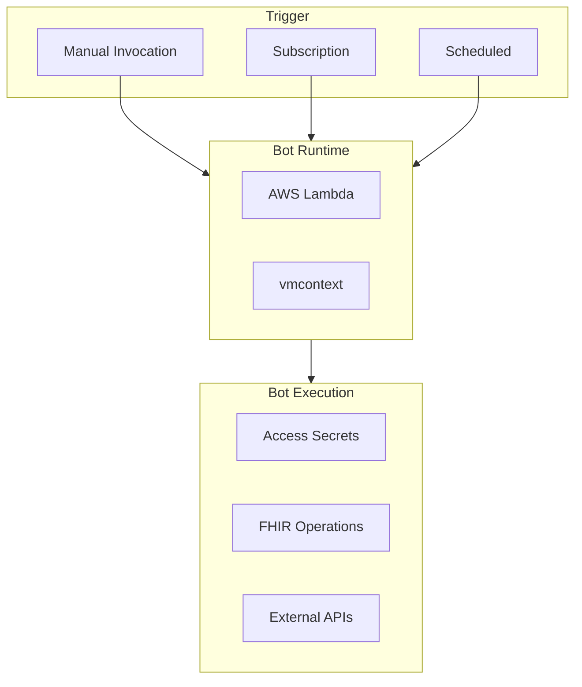
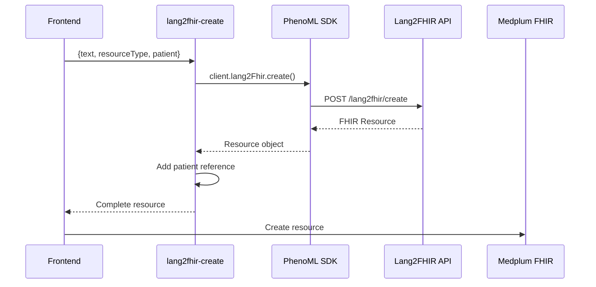
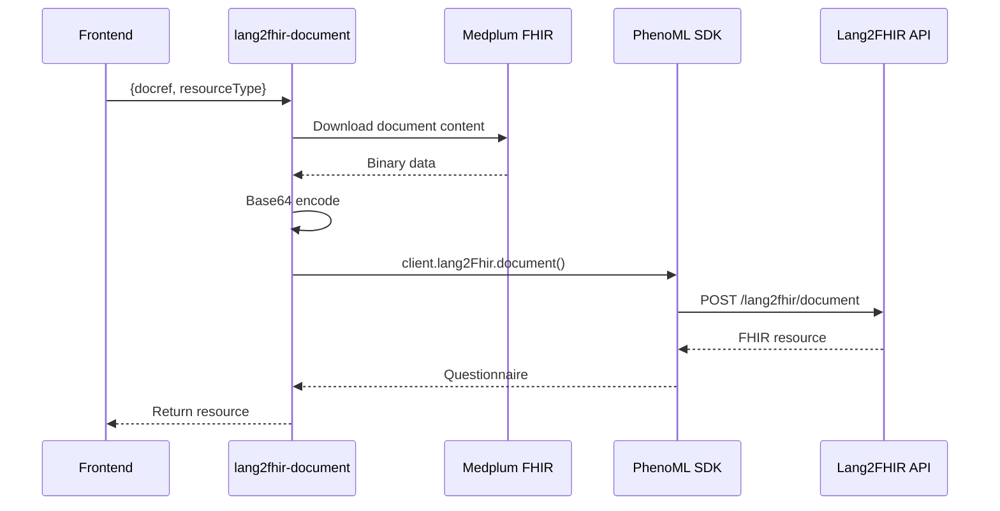
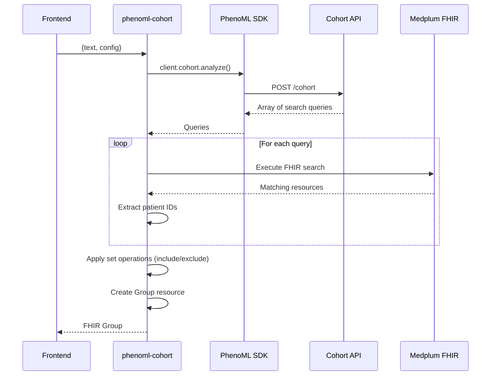
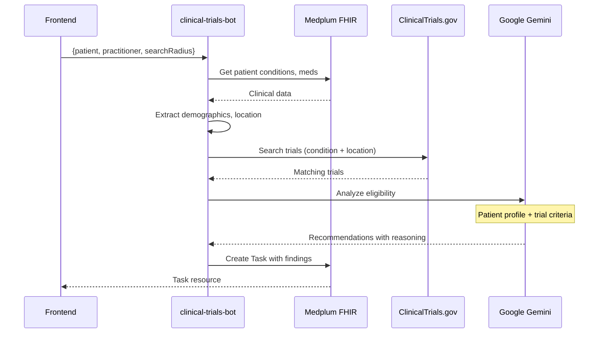
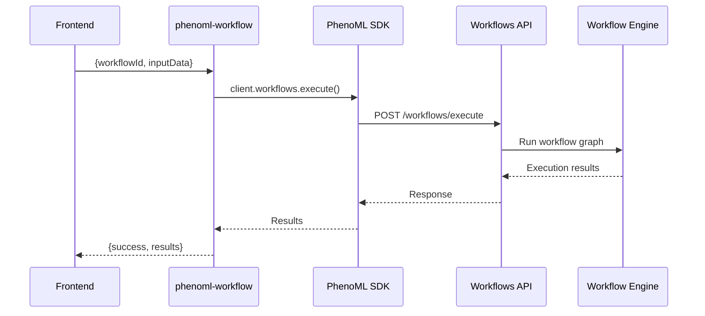

# Bot System Documentation

Complete documentation of the Medplum bot system and the 5 integration bots.

## What Are Medplum Bots?

Medplum bots are TypeScript functions that run in response to events or manual invocation. They execute in isolated environments (AWS Lambda or Node.js VM) and can:

- Access Medplum FHIR resources
- Read secrets from the secrets vault
- Call external APIs
- Create, update, and delete resources



## Runtime Environments

| Runtime | Use Case | Configuration |
|---------|----------|---------------|
| `awslambda` | Production (hosted Medplum) | Default for app.medplum.com |
| `vmcontext` | Development (local Medplum) | Set in deploy-bots.ts |

**Configure in `src/scripts/deploy-bots.ts`:**

```typescript
runtimeVersion: 'vmcontext',  // For local development
// OR
runtimeVersion: 'awslambda',  // For production
```

## The 5 Integration Bots

### 1. lang2fhir-create

**Purpose:** Convert natural language text to FHIR resources

**File:** `src/bots/lang2fhir-create.ts`

**Input:**
```typescript
interface Input {
  text: string;           // Natural language clinical text
  resourceType: string;   // Target FHIR resource type
  patient?: string;       // Optional patient ID
}
```

**Output:** FHIR resource (Observation, Condition, Procedure, etc.)

**Supported Resource Types:**

| Input | PhenoML Profile | FHIR Resource |
|-------|-----------------|---------------|
| `observation` | `simple-observation` | Observation |
| `condition` | `condition-encounter-diagnosis` | Condition |
| `procedure` | `procedure` | Procedure |
| `medicationrequest` | `medicationrequest` | MedicationRequest |
| `careplan` | `careplan` | CarePlan |
| `plandefinition` | `plandefinition` | PlanDefinition |
| `questionnaire` | `questionnaire` | Questionnaire |
| `questionnaireresponse` | `questionnaire-response` | QuestionnaireResponse |
| `researchstudy` | `researchstudy` | ResearchStudy |

**Example Usage:**
```typescript
const result = await medplum.executeBot(botId, {
  text: 'Patient has blood pressure of 120/80 mmHg',
  resourceType: 'observation',
  patient: '123',
});
```

**Data Flow:**


---

### 2. lang2fhir-document

**Purpose:** Process documents (PDF, images) into FHIR Questionnaires

**File:** `src/bots/lang2fhir-document.ts`

**Input:**
```typescript
interface Input {
  docref: DocumentReference;  // Medplum DocumentReference
  resourceType: string;       // 'questionnaire' or 'questionnaire-response'
}
```

**Output:** FHIR Questionnaire or QuestionnaireResponse

**Supported File Types:**

| MIME Type | Extension | Processing |
|-----------|-----------|------------|
| `application/pdf` | .pdf | Text extraction |
| `image/png` | .png | Vision LLM |
| `image/jpeg` | .jpg, .jpeg | Vision LLM |

**Data Flow:**


---

### 3. phenoml-cohort

**Purpose:** Convert natural language descriptions to patient cohorts

**File:** `src/bots/phenoml-cohort.ts`

**Input:**
```typescript
interface Input {
  text: string;          // Natural language cohort description
  config?: {
    excludeDeceased?: boolean;
  };
}
```

**Output:** FHIR Group resource with matching patients

**Example:**
```typescript
const result = await medplum.executeBot(botId, {
  text: 'Female patients over 40 with diabetes but not hypertension',
  config: { excludeDeceased: true },
});

// Returns FHIR Group with member references
```

**Data Flow:**


**Query Structure:**
```typescript
interface Query {
  resource_type: 'Patient' | 'Condition' | 'Observation' | 'Procedure';
  search_params: string;  // FHIR search params
  concept: string;        // Original text
  exclude: boolean;       // Exclude from cohort?
}
```

**Set Operations:**
- **Include queries**: Intersect results (AND)
- **Exclude queries**: Remove from final set (NOT)

---

### 4. clinical-trials-bot

**Purpose:** Find and analyze clinical trials for patients

**File:** `src/bots/clinical-trials-bot.ts`

**Input:**
```typescript
interface Input {
  patient: Patient;           // FHIR Patient resource
  practitioner?: Practitioner;
  searchRadius?: number;      // Miles from patient location
}
```

**Output:** Task resource with trial recommendations

**Data Flow:**


**Search Strategy:**
1. Search by condition + city + state (most specific)
2. Fallback: condition + state only
3. Fallback: condition only (no location filter)

**Gemini Analysis Output:**
```typescript
interface TrialRecommendation {
  nctId: string;
  recommendation: 'high' | 'medium' | 'low';
  reasoning: string;
  eligibilityAssessment: string;
  medicationConsiderations?: string;
  nextSteps?: string;
}
```

---

### 5. phenoml-workflow

**Purpose:** Execute PhenoML workflows

**File:** `src/bots/phenoml-workflow.ts`

**Input:**
```typescript
interface Input {
  workflowId: string;
  inputData: Record<string, unknown>;
}
```

**Output:**
```typescript
interface Output {
  success: boolean;
  message: string;
  workflowId: string;
  results?: ExecuteWorkflowResponse['results'];
}
```

**Data Flow:**


## Bot Deployment

### Build Process

```bash
npm run build:bots
```

This command:
1. **Clean**: Removes previous `dist/` directory
2. **Lint**: Runs ESLint on all files
3. **Compile**: TypeScript → JavaScript (CommonJS)
4. **Bundle**: Generates `data/example/example-bots.json`

### Deploy Script

**File:** `src/scripts/deploy-bots.ts`

```typescript
const botConfigs = [
  {
    name: 'lang2fhir-create',
    description: 'Convert text to FHIR resources',
    source: 'src/bots/lang2fhir-create.ts',
  },
  {
    name: 'lang2fhir-document',
    description: 'Process documents to FHIR',
    source: 'src/bots/lang2fhir-document.ts',
  },
  // ... more bots
];
```

### Bundle Structure

The generated `example-bots.json` contains:
- Bot definitions as FHIR resources
- Source code as Base64-encoded Binary resources
- Compiled JavaScript as Binary resources

### Importing Bots

1. Go to Medplum Admin → Batch Upload
2. Upload `data/example/example-bots.json`
3. Bots are created and ready to use

## Modifying Bots

### Adding a New Bot

1. **Create bot file** in `src/bots/`:
```typescript
// src/bots/my-new-bot.ts
import { BotEvent, MedplumClient } from '@medplum/core';

export async function handler(
  medplum: MedplumClient,
  event: BotEvent
): Promise<any> {
  const { myInput } = event.input;

  // Bot logic here

  return { success: true, result: '...' };
}
```

2. **Add to deploy script** `src/scripts/deploy-bots.ts`:
```typescript
botConfigs.push({
  name: 'my-new-bot',
  description: 'Description of my bot',
  source: 'src/bots/my-new-bot.ts',
});
```

3. **Build and deploy**:
```bash
npm run build:bots
# Then upload example-bots.json to Medplum
```

### Bot Handler Signature

```typescript
export async function handler(
  medplum: MedplumClient,  // Authenticated Medplum client
  event: BotEvent          // Event data including input and secrets
): Promise<any> {
  // Access input
  const input = event.input;

  // Access secrets
  const apiKey = event.secrets['MY_API_KEY']?.valueString;

  // Use Medplum client
  const patient = await medplum.readResource('Patient', '123');

  // Return result
  return { success: true };
}
```

### BotEvent Structure

```typescript
interface BotEvent {
  input: any;                    // Input passed to executeBot()
  secrets: Record<string, {      // Medplum secrets
    valueString?: string;
  }>;
  contentType: string;
  // ... other fields
}
```

## Testing Bots Locally

### Unit Testing

```typescript
// src/bots/__tests__/my-bot.test.ts
import { handler } from '../my-bot';
import { MockClient } from '@medplum/mock';

describe('my-bot', () => {
  test('processes input correctly', async () => {
    const medplum = new MockClient();
    const event = {
      input: { text: 'test input' },
      secrets: {
        'PHENOML_EMAIL': { valueString: 'test@example.com' },
        'PHENOML_PASSWORD': { valueString: 'password' },
      },
    };

    const result = await handler(medplum, event as any);

    expect(result.success).toBe(true);
  });
});
```

### Running Tests

```bash
npm run test
npm run test:coverage
```

### Manual Testing

1. Start the app: `npm run dev`
2. Navigate to a page that uses the bot
3. Trigger bot execution through the UI
4. Check browser console and Medplum logs for output

## Error Handling

### Best Practices

```typescript
export async function handler(
  medplum: MedplumClient,
  event: BotEvent
): Promise<any> {
  // Validate secrets
  const email = event.secrets['PHENOML_EMAIL']?.valueString;
  const password = event.secrets['PHENOML_PASSWORD']?.valueString;

  if (!email || !password) {
    throw new Error('PhenoML credentials not configured. Add PHENOML_EMAIL and PHENOML_PASSWORD secrets.');
  }

  // Validate input
  const { text, resourceType } = event.input;
  if (!text) {
    throw new Error('Missing required input: text');
  }

  try {
    // Bot logic
    const result = await processData(text);
    return { success: true, result };
  } catch (error) {
    // Handle specific errors
    if (error.status === 401) {
      throw new Error('PhenoML authentication failed. Check credentials.');
    }
    if (error.status === 429) {
      throw new Error('Rate limit exceeded. Please try again later.');
    }
    // Re-throw unknown errors
    throw error;
  }
}
```

### Common Errors

| Error | Cause | Solution |
|-------|-------|----------|
| `credentials not configured` | Missing secrets | Add PHENOML_EMAIL/PASSWORD in Medplum Admin |
| `authentication failed` | Invalid credentials | Verify credentials in PhenoML dashboard |
| `rate limit exceeded` | Too many requests | Wait and retry; consider upgrading plan |
| `resource not found` | Invalid resource type | Check supported resource types |

## Related Documentation

- [ARCHITECTURE.md](./ARCHITECTURE.md) - System architecture
- [PHENOML_INTEGRATION.md](./PHENOML_INTEGRATION.md) - Integration details
- [PHENOML_APIS.md](./PHENOML_APIS.md) - API reference
- [DATA_FLOWS.md](./DATA_FLOWS.md) - Complete data flows
