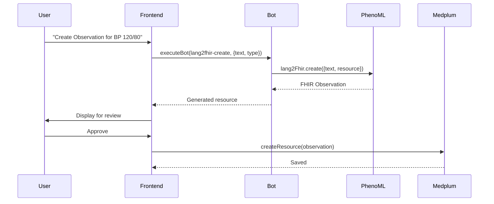
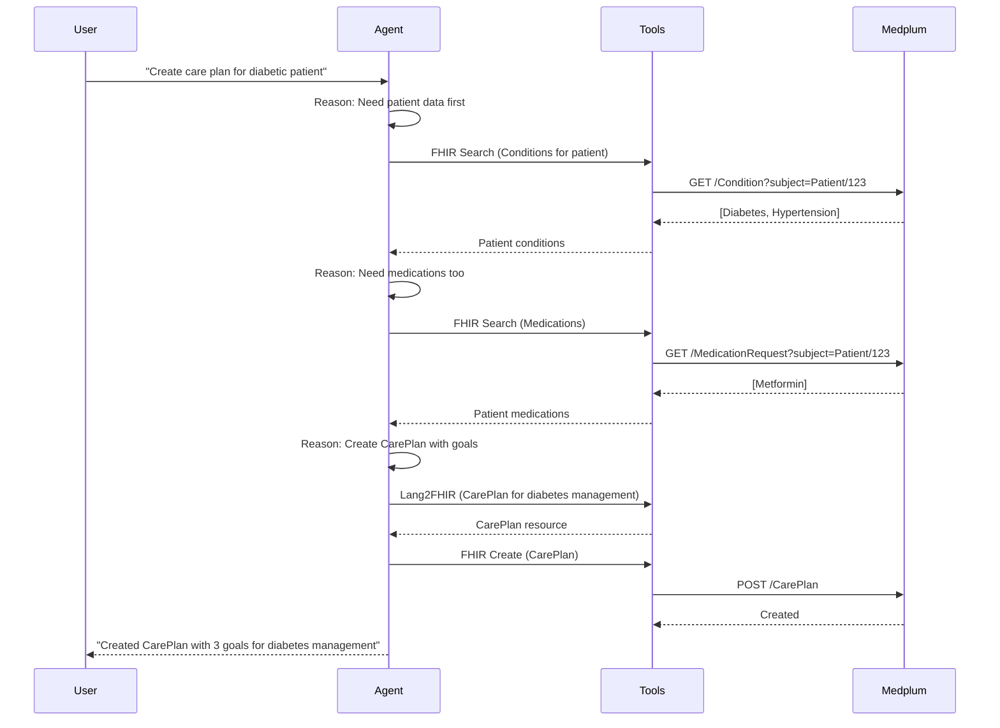

# Bot-Based vs Agent-Based Architecture

This document compares two architectural patterns for integrating PhenoML with an EHR system like Medplum.

## Overview

| Architecture | Orchestration | Complexity | User Control |
|--------------|---------------|------------|--------------|
| **Bot-Based** | Frontend controls flow | Simple, predictable | High |
| **Agent-Based** | LLM Agent decides flow | Complex, autonomous | Lower |

---

## Bot-Based Architecture (Current Implementation)

```
┌─────────────────────────────────────────────────────────────────┐
│                         FRONTEND (React)                         │
│                    Controls the entire flow                      │
└─────────────────────────────────────────────────────────────────┘
          │                    │                    │
          ▼                    ▼                    ▼
    ┌──────────┐        ┌──────────┐        ┌──────────┐
    │lang2fhir │        │  cohort  │        │ clinical │
    │   bot    │        │   bot    │        │  trials  │
    └──────────┘        └──────────┘        └──────────┘
          │                    │                    │
          ▼                    ▼                    ▼
┌─────────────────────────────────────────────────────────────────┐
│                      PHENOML APIs                                │
│              (Lang2FHIR, Cohort, Construe)                       │
└─────────────────────────────────────────────────────────────────┘
          │
          ▼
┌─────────────────────────────────────────────────────────────────┐
│                    MEDPLUM (FHIR Server)                         │
│                 Data Store + Bot Runtime                         │
└─────────────────────────────────────────────────────────────────┘
```

### Characteristics

- **Frontend orchestrates** - UI decides which bot to call and when
- **Single-purpose bots** - Each bot does ONE thing (create Observation, process document, etc.)
- **Human-in-the-loop** - User reviews each generated resource before saving
- **Medplum is central** - Both the orchestrator (bots) and data store (FHIR)
- **Predictable behavior** - Same input always triggers same workflow

### Data Flow



---

## Agent-Based Architecture (Alternative)

```
┌─────────────────────────────────────────────────────────────────┐
│                      CHAT / UI INTERFACE                         │
│        "Create a care plan for this diabetic patient"            │
└─────────────────────────────────────────────────────────────────┘
                              │
                              ▼
┌─────────────────────────────────────────────────────────────────┐
│                       PHENOML AGENT                              │
│                  Autonomous orchestrator                         │
│    ┌─────────────────────────────────────────────────────────┐  │
│    │  LLM (Gemini) decides:                                   │  │
│    │  1. What tools to use                                    │  │
│    │  2. In what order                                        │  │
│    │  3. How to combine results                               │  │
│    └─────────────────────────────────────────────────────────┘  │
└─────────────────────────────────────────────────────────────────┘
          │              │              │              │
          ▼              ▼              ▼              ▼
    ┌──────────┐  ┌──────────┐  ┌──────────┐  ┌──────────┐
    │Lang2FHIR │  │  Cohort  │  │  Search  │  │  Create  │
    │  Tool    │  │   Tool   │  │   Tool   │  │   Tool   │
    └──────────┘  └──────────┘  └──────────┘  └──────────┘
                              │
                              ▼
┌─────────────────────────────────────────────────────────────────┐
│                  MEDPLUM (via fhir_provider)                     │
│                      Pure EHR / Data Store                       │
└─────────────────────────────────────────────────────────────────┘
```

### Characteristics

- **Agent orchestrates** - LLM decides what to do based on natural language input
- **Multi-step reasoning** - Agent can chain multiple operations autonomously
- **Tools available** - Lang2FHIR, Cohort, FHIR CRUD, MCP tools, etc.
- **Medplum is just the EHR** - Data store accessed via FHIR API
- **Flexible behavior** - Agent adapts approach based on context

### Data Flow



---

## Side-by-Side Comparison

| Aspect | Bot-Based | Agent-Based |
|--------|-----------|-------------|
| **Orchestration** | Frontend/UI controls flow | LLM Agent decides flow |
| **Complexity** | Simple, predictable | Can handle complex multi-step tasks |
| **User Control** | High - user triggers each action | Lower - agent acts autonomously |
| **Typical Input** | "Create an Observation from this text" | "Review this patient and create a care plan" |
| **Error Handling** | Explicit per-bot | Agent must reason about errors |
| **Transparency** | Clear what each bot does | May need to trace agent's reasoning |
| **Medplum's Role** | Central hub (bots + data) | Just the EHR backend |
| **Latency** | Single API call per action | Multiple calls as agent reasons |
| **Cost** | Lower (fewer LLM calls) | Higher (LLM reasoning at each step) |

---

## Practical Example: Same Task, Different Approaches

**Task**: "Patient has diabetes, hypertension, and is on Metformin. Create appropriate resources."

### Bot-Based Approach

```typescript
// Frontend must orchestrate each step manually:

// Step 1: Create Condition for diabetes
const diabetes = await medplum.executeBot(lang2fhirBot, {
  text: "Type 2 Diabetes Mellitus",
  resourceType: "Condition",
  patient
});
// User reviews...
await medplum.createResource(diabetes);

// Step 2: Create Condition for hypertension
const hypertension = await medplum.executeBot(lang2fhirBot, {
  text: "Essential hypertension",
  resourceType: "Condition",
  patient
});
// User reviews...
await medplum.createResource(hypertension);

// Step 3: Create MedicationRequest
const metformin = await medplum.executeBot(lang2fhirBot, {
  text: "Metformin 500mg twice daily",
  resourceType: "MedicationRequest",
  patient
});
// User reviews...
await medplum.createResource(metformin);

// Total: 3 bot calls, 3 user reviews, 3 saves
```

### Agent-Based Approach

```typescript
// Single request to agent:
const result = await phenomlAgent.execute({
  prompt: `Patient has diabetes, hypertension, and is on Metformin 500mg
           twice daily. Create the appropriate clinical resources.`,
  patient: patientReference,
  fhirProvider: medplumConfig
});

// Agent internally:
// 1. Reasons: "I need to create 2 Conditions and 1 MedicationRequest"
// 2. Calls Lang2FHIR tool for diabetes → Condition
// 3. Calls Lang2FHIR tool for hypertension → Condition
// 4. Calls Lang2FHIR tool for Metformin → MedicationRequest
// 5. Links them (reasonReference on MedicationRequest → Condition)
// 6. Creates all resources in Medplum via fhir_provider
// 7. Returns summary

console.log(result);
// "Created 3 resources:
//  - Condition: Type 2 Diabetes Mellitus (E11.9)
//  - Condition: Essential Hypertension (I10)
//  - MedicationRequest: Metformin 500mg BID (linked to diabetes)"
```

---

## PhenoML Agent Capabilities

The PhenoML backend's agent module has access to these tools:

```go
// From the tools module - available to agents
type API interface {
    // Cohort analysis
    Cohort(ctx, request, fhirAuth) (*CohortToolResponse, error)

    // Create FHIR resource and search for related
    Lang2FhirAndSearch(ctx, request, fhirAuth) (*Lang2FhirAndSearchResponse, error)

    // Create FHIR resource and persist to EHR
    Lang2FhirAndCreate(ctx, request, fhirAuth) (*Lang2FhirAndCreateResponse, error)

    // Extract multiple resources from complex text
    Lang2FhirAndCreateMulti(ctx, request, fhirAuth) (*Lang2FhirAndCreateMultiResponse, error)

    // Call external MCP tools
    CallMCPTool(ctx, serverName, serverURL, toolName, args) (*CallToolResult, error)
}
```

### Agent Reasoning Example

```
User: "Find diabetic patients over 50 and create a screening reminder for each"

Agent's internal reasoning:
┌─────────────────────────────────────────────────────────────────┐
│ Step 1: Understand the request                                   │
│ - Need to find patients matching criteria                        │
│ - Need to create Task resources for each                         │
├─────────────────────────────────────────────────────────────────┤
│ Step 2: Use Cohort tool                                          │
│ Input: "diabetic patients over 50"                               │
│ Output: [Patient/1, Patient/7, Patient/23, ...]                  │
├─────────────────────────────────────────────────────────────────┤
│ Step 3: For each patient, use Lang2FhirAndCreate                 │
│ Input: "Diabetes screening reminder" + patient reference         │
│ Output: Task resource created in Medplum                         │
├─────────────────────────────────────────────────────────────────┤
│ Step 4: Return summary                                           │
│ "Created 15 screening reminder tasks for diabetic patients >50"  │
└─────────────────────────────────────────────────────────────────┘
```

---

## When to Use Which?

### Use Bot-Based When:

- **Predictable workflows** - You know exactly what needs to happen
- **Human review required** - Each resource needs approval before saving
- **Simple operations** - One input → one output
- **Medplum-centric** - You want everything running within Medplum
- **Auditability** - Need clear trace of who did what
- **Lower cost** - Fewer LLM calls needed

### Use Agent-Based When:

- **Complex reasoning** - "Review this patient's chart and suggest interventions"
- **Multi-step tasks** - Need to search, analyze, create, and link resources
- **Natural language interface** - Users describe what they want, not how
- **Autonomous operation** - Agent can act without step-by-step guidance
- **Multiple EHR backends** - Agent can work with different FHIR servers
- **Exploratory tasks** - "What patterns do you see in this patient population?"

---

## Hybrid Approach

You can combine both architectures:

```
┌─────────────────────────────────────────────────────────────────┐
│                         FRONTEND UI                              │
└─────────────────────────────────────────────────────────────────┘
          │                              │
          │ Simple tasks                 │ Complex tasks
          ▼                              ▼
    ┌──────────┐                  ┌──────────────┐
    │   Bots   │                  │    Agent     │
    │ (Direct) │                  │  (Reasoning) │
    └──────────┘                  └──────────────┘
          │                              │
          ▼                              ▼
┌─────────────────────────────────────────────────────────────────┐
│                      PHENOML BACKEND                             │
│              Lang2FHIR, Cohort, Construe, Tools                  │
└─────────────────────────────────────────────────────────────────┘
                              │
                              ▼
┌─────────────────────────────────────────────────────────────────┐
│                         MEDPLUM                                  │
│                     FHIR Data Store                              │
└─────────────────────────────────────────────────────────────────┘
```

### Example Hybrid Usage

```typescript
// Simple: Use bot directly
const observation = await medplum.executeBot(lang2fhirBot, {
  text: "BP 120/80",
  resourceType: "Observation",
  patient
});

// Complex: Use agent
const analysis = await phenomlAgent.execute({
  prompt: "Summarize this patient's cardiovascular risk factors and suggest a monitoring plan",
  patient: patientReference,
  fhirProvider: medplumConfig
});
```

---

## Security Considerations

### Bot-Based

- Credentials stored in Medplum secrets
- Each bot has explicit, limited scope
- User must approve each action
- Clear audit trail

### Agent-Based

- Agent has broader permissions (can search, create, update)
- Guardrails needed to prevent unintended actions
- May need approval workflow for certain operations
- Reasoning trace should be logged for audit

---

## Implementation Recommendations

1. **Start with bots** for well-defined workflows
2. **Add agent** for complex queries and analysis
3. **Use guardrails** to limit agent actions in clinical context
4. **Log everything** for auditability
5. **Human review** for any resource creation in clinical settings

---

## Related Documentation

- [HOW_BOTS_WORK.md](./HOW_BOTS_WORK.md) - Detailed bot implementation
- [PHENOML_APIS.md](./PHENOML_APIS.md) - PhenoML API reference
- [ARCHITECTURE.md](./ARCHITECTURE.md) - System architecture
