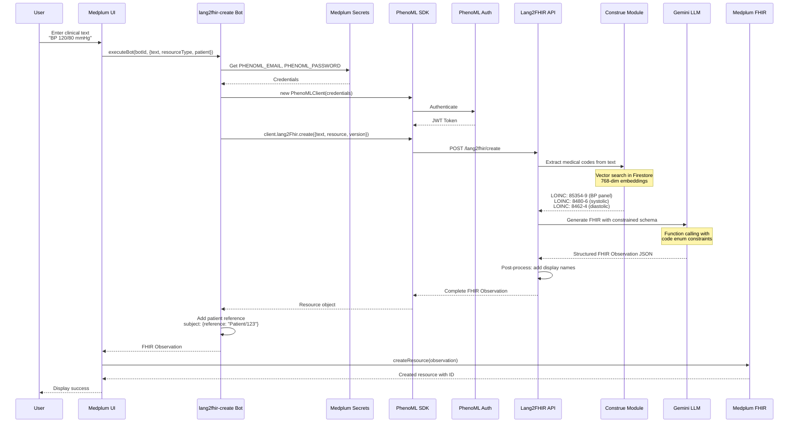
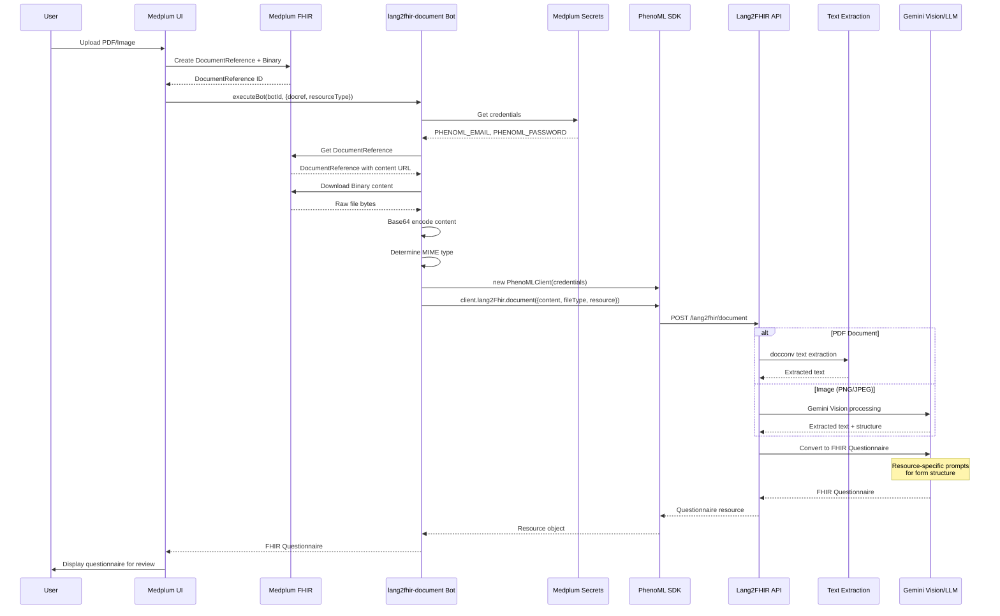
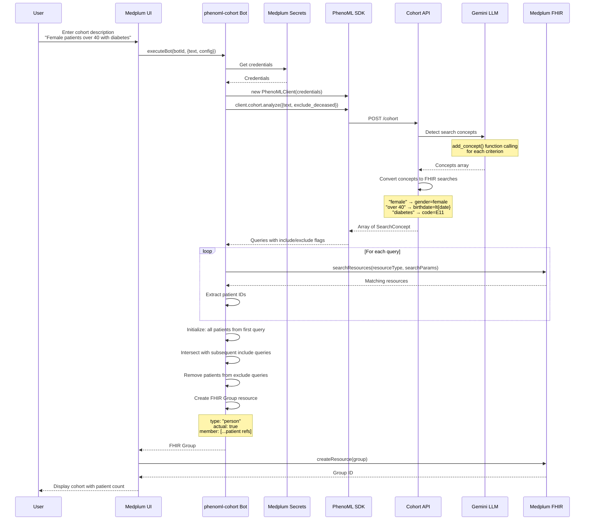
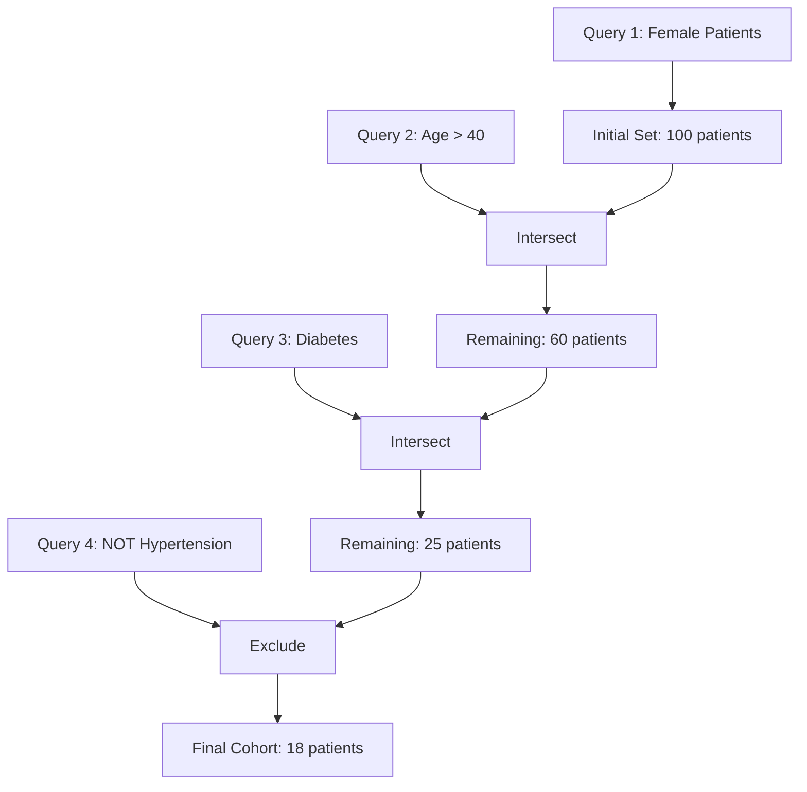
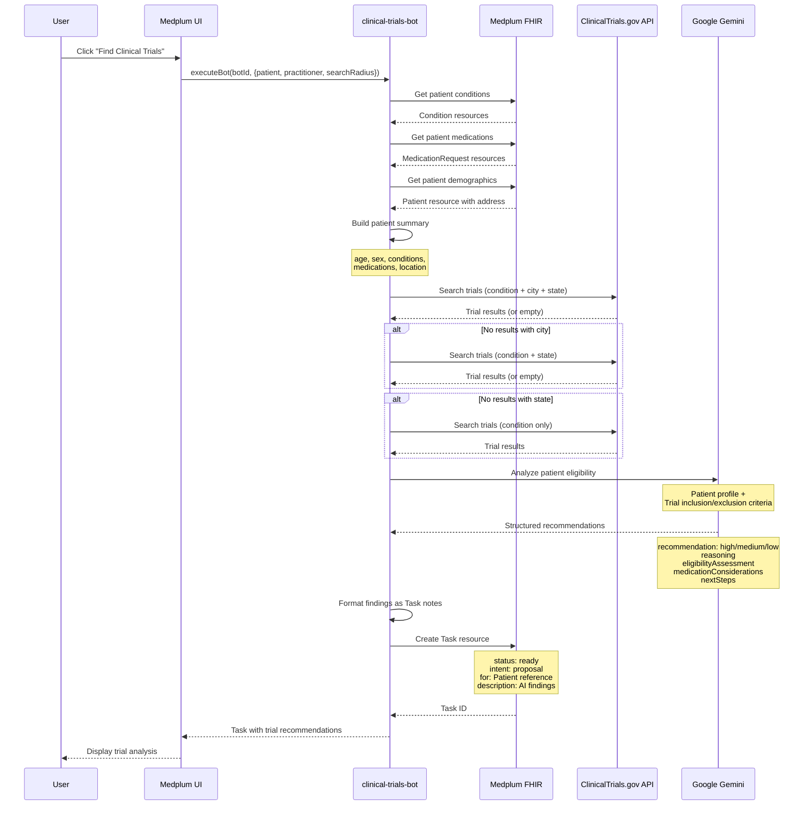
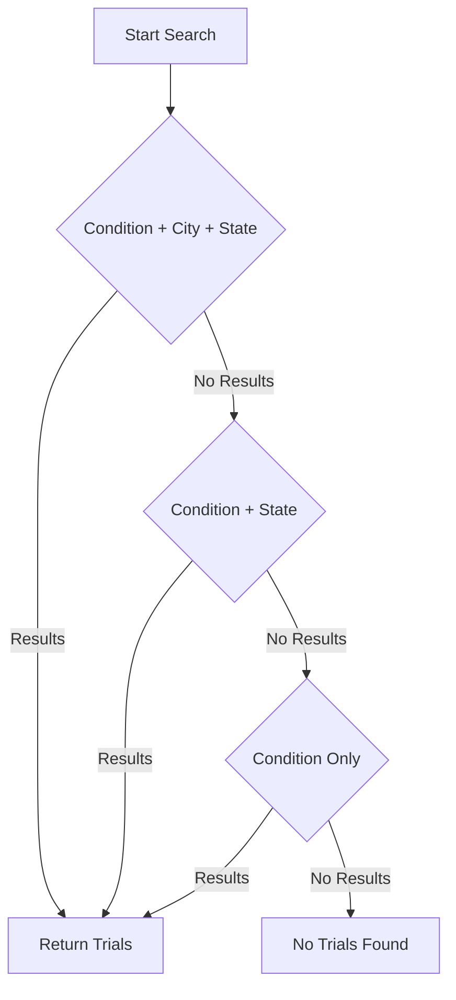
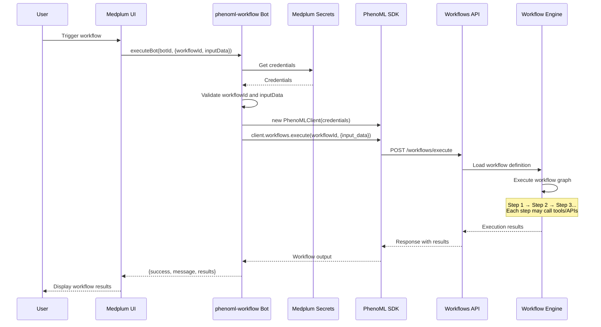
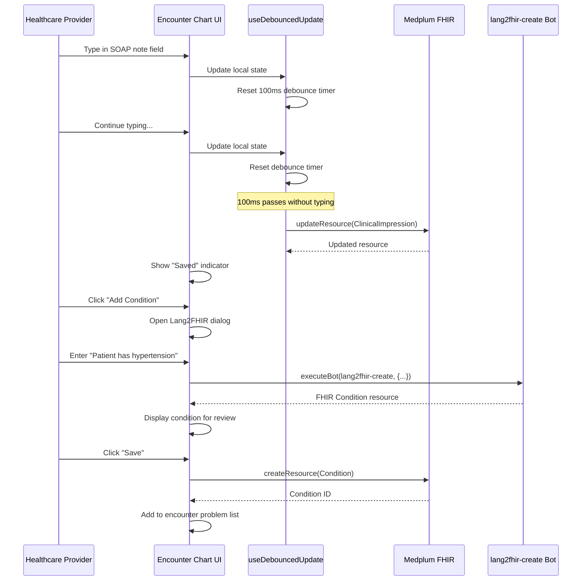
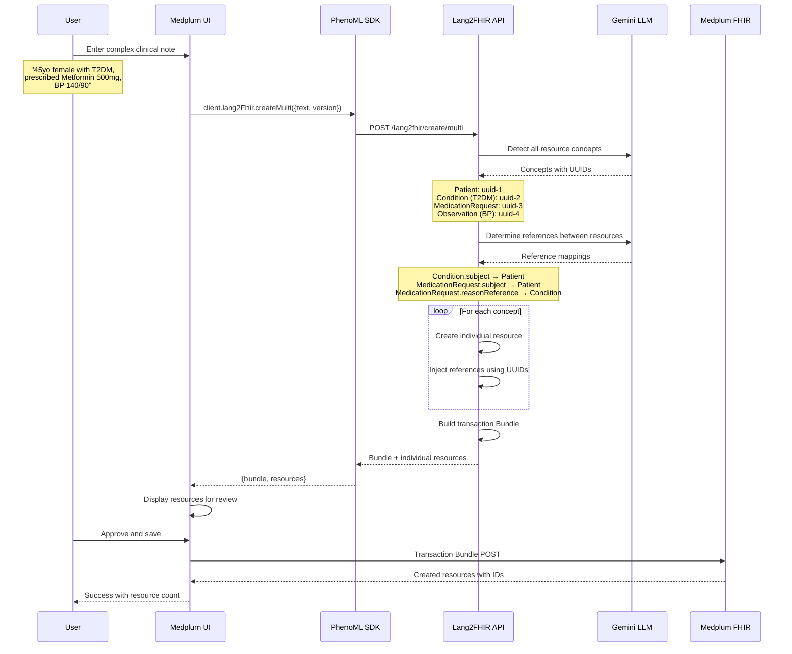

# Data Flow Documentation

Detailed data flow diagrams for all major operations in the Medplum Provider with Lang2FHIR application.

## Overview

This document provides comprehensive sequence diagrams showing how data flows through the system for each major operation.

## Flow 1: Text to FHIR Resource

Convert natural language clinical text into structured FHIR resources.

### Sequence Diagram



### Key Points

- **Code Extraction**: Construe uses vector search to find valid medical codes
- **Constrained Generation**: LLM can only use extracted codes (prevents hallucination)
- **Patient Linking**: Bot adds patient reference before returning

---

## Flow 2: Document Processing

Upload PDF or images and convert to FHIR Questionnaires.

### Sequence Diagram



### Supported File Types

| Type | MIME | Processing Method |
|------|------|-------------------|
| PDF | `application/pdf` | docconv text extraction |
| PNG | `image/png` | Gemini Vision |
| JPEG | `image/jpeg` | Gemini Vision |

---

## Flow 3: Cohort Creation

Create patient cohorts from natural language descriptions.

### Sequence Diagram



### Set Operation Logic



---

## Flow 4: Clinical Trials Search

Find and analyze clinical trials for a specific patient.

### Sequence Diagram



### Search Strategy



---

## Flow 5: Workflow Execution

Execute custom PhenoML workflows.

### Sequence Diagram



---

## Flow 6: Encounter Charting with Auto-Save

Real-time encounter documentation with debounced updates.

### Sequence Diagram



### Debounce Configuration

```typescript
const DEBOUNCE_MS = 100;

// In useEncounterChart hook
const debouncedUpdate = useDebouncedUpdateResource(
  DEBOUNCE_MS
);
```

---

## Flow 7: Multi-Resource Extraction

Extract multiple related FHIR resources from a single clinical note.

### Sequence Diagram



### Bundle Structure

```json
{
  "resourceType": "Bundle",
  "type": "transaction",
  "entry": [
    {
      "fullUrl": "urn:uuid:uuid-1",
      "resource": { "resourceType": "Patient", ... },
      "request": { "method": "POST", "url": "Patient" }
    },
    {
      "fullUrl": "urn:uuid:uuid-2",
      "resource": {
        "resourceType": "Condition",
        "subject": { "reference": "urn:uuid:uuid-1" },
        ...
      },
      "request": { "method": "POST", "url": "Condition" }
    },
    {
      "fullUrl": "urn:uuid:uuid-3",
      "resource": {
        "resourceType": "MedicationRequest",
        "subject": { "reference": "urn:uuid:uuid-1" },
        "reasonReference": [{ "reference": "urn:uuid:uuid-2" }],
        ...
      },
      "request": { "method": "POST", "url": "MedicationRequest" }
    }
  ]
}
```

---

## Summary

| Flow | Purpose | Key Components |
|------|---------|----------------|
| **Text to FHIR** | NLP → structured data | Construe, Gemini, Function Calling |
| **Document Processing** | PDF/Image → Questionnaire | Vision LLM, docconv |
| **Cohort Creation** | Language → Patient groups | Concept detection, Set operations |
| **Clinical Trials** | Patient matching | ClinicalTrials.gov, Gemini analysis |
| **Workflow Execution** | Custom automation | Workflow engine |
| **Encounter Charting** | Real-time documentation | Debounced updates |
| **Multi-Resource** | Complex notes | Reference resolution, Bundles |

## Related Documentation

- [ARCHITECTURE.md](./ARCHITECTURE.md) - System architecture
- [PHENOML_INTEGRATION.md](./PHENOML_INTEGRATION.md) - Integration details
- [PHENOML_APIS.md](./PHENOML_APIS.md) - API reference
- [BOTS.md](./BOTS.md) - Bot implementation
