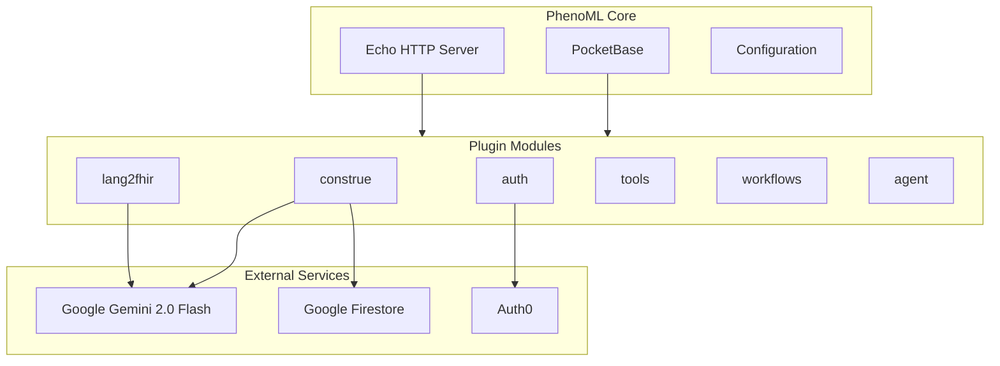
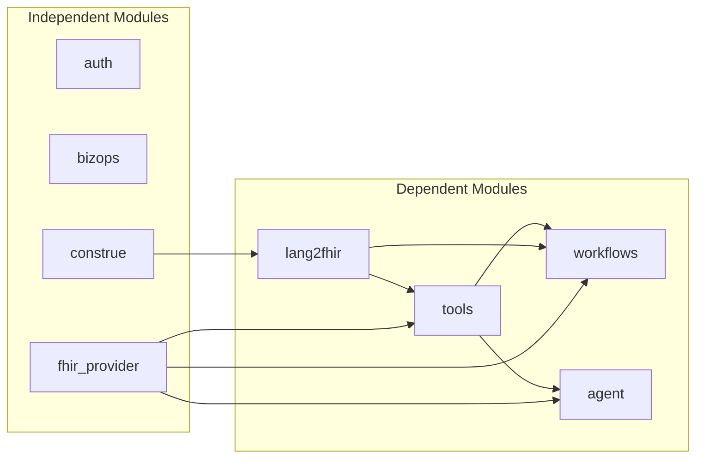
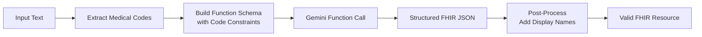
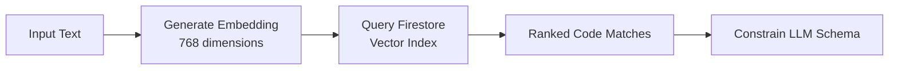
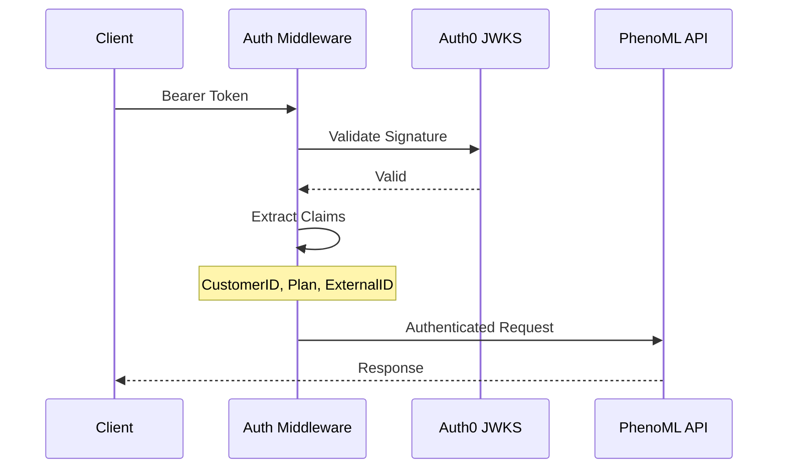

# PhenoML Backend API Reference

Comprehensive documentation of the PhenoML backend APIs, modules, and architecture.

## Backend Overview

PhenoML is a Go-based healthcare platform built on PocketBase with a modular plugin architecture. It uses Google Gemini for LLM processing and Firestore for vector search.



## Module Architecture

### Module Dependencies



### Module Load Order

Modules are loaded in dependency order:

1. `auth` - Authentication (independent)
2. `bizops` - Business operations (independent)
3. `fhir_provider` - FHIR provider management (independent)
4. `construe` - Medical code extraction (independent)
5. `lang2fhir` - Text to FHIR (depends on construe)
6. `tools` - LLM tools (depends on fhir_provider, lang2fhir)
7. `workflows` - Workflow engine (depends on fhir_provider, lang2fhir, tools)
8. `agent` - AI agent (depends on fhir_provider, tools)

## API Endpoints

### Lang2FHIR Module

#### Create Single Resource

**Endpoint:** `POST /lang2fhir/create`

**Request:**
```json
{
  "text": "Patient has blood pressure of 120/80 mmHg",
  "resource": "simple-observation",
  "version": "R4",
  "provider": "canvas"
}
```

**Response:**
```json
{
  "resourceType": "Observation",
  "status": "final",
  "code": {
    "coding": [{
      "system": "http://loinc.org",
      "code": "85354-9",
      "display": "Blood pressure panel"
    }]
  },
  "component": [
    {
      "code": {
        "coding": [{
          "system": "http://loinc.org",
          "code": "8480-6",
          "display": "Systolic blood pressure"
        }]
      },
      "valueQuantity": {
        "value": 120,
        "unit": "mmHg",
        "system": "http://unitsofmeasure.org",
        "code": "mm[Hg]"
      }
    },
    {
      "code": {
        "coding": [{
          "system": "http://loinc.org",
          "code": "8462-4",
          "display": "Diastolic blood pressure"
        }]
      },
      "valueQuantity": {
        "value": 80,
        "unit": "mmHg",
        "system": "http://unitsofmeasure.org",
        "code": "mm[Hg]"
      }
    }
  ]
}
```

**Parameters:**

| Field | Type | Required | Description |
|-------|------|----------|-------------|
| `text` | string | Yes | Natural language clinical text |
| `resource` | string | Yes | Target resource type (see below) |
| `version` | string | No | FHIR version (default: "R4") |
| `provider` | string | No | EHR provider for custom profiles |

**Supported Resource Types:**

| Resource Name | FHIR Resource | Description |
|---------------|---------------|-------------|
| `simple-observation` | Observation | Clinical observations |
| `condition-encounter-diagnosis` | Condition | Diagnoses and problems |
| `procedure` | Procedure | Clinical procedures |
| `medicationrequest` | MedicationRequest | Medication orders |
| `careplan` | CarePlan | Care plans |
| `plandefinition` | PlanDefinition | Care plan templates |
| `questionnaire` | Questionnaire | Form definitions |
| `questionnaire-response` | QuestionnaireResponse | Form responses |
| `researchstudy` | ResearchStudy | Clinical trials |

#### Create Multiple Resources

**Endpoint:** `POST /lang2fhir/create/multi`

**Request:**
```json
{
  "text": "45-year-old female with Type 2 Diabetes, prescribed Metformin 500mg",
  "version": "R4"
}
```

**Response:**
```json
{
  "bundle": {
    "resourceType": "Bundle",
    "type": "transaction",
    "entry": [
      {
        "resource": { "resourceType": "Patient", ... },
        "request": { "method": "POST", "url": "Patient" }
      },
      {
        "resource": { "resourceType": "Condition", ... },
        "request": { "method": "POST", "url": "Condition" }
      },
      {
        "resource": { "resourceType": "MedicationRequest", ... },
        "request": { "method": "POST", "url": "MedicationRequest" }
      }
    ]
  },
  "resources": [...]
}
```

#### Process Document

**Endpoint:** `POST /lang2fhir/document`

**Request:**
```json
{
  "version": "R4",
  "resource": "questionnaire",
  "content": "base64-encoded-document-content",
  "fileType": "application/pdf"
}
```

**Response:** FHIR Questionnaire or QuestionnaireResponse resource

**Supported File Types:**

| MIME Type | Processing Method |
|-----------|-------------------|
| `application/pdf` | Text extraction via docconv |
| `image/png` | Vision LLM (Gemini) |
| `image/jpeg` | Vision LLM (Gemini) |

#### Generate Search Query

**Endpoint:** `POST /lang2fhir/search`

**Request:**
```json
{
  "text": "patients with diabetes diagnosed in 2023"
}
```

**Response:**
```json
{
  "resource_type": "Condition",
  "search_params": "code=E11&onset-date=ge2023-01-01&onset-date=le2023-12-31"
}
```

### Cohort Module

#### Analyze Cohort

**Endpoint:** `POST /cohort`

**Request:**
```json
{
  "text": "Female patients over 40 with diabetes but not hypertension",
  "include_extract_results": true,
  "include_rationale": true,
  "exclude_deceased": true
}
```

**Response:**
```json
{
  "success": true,
  "message": "Generated 3 search queries",
  "queries": [
    {
      "resource_type": "Patient",
      "search_params": "gender=female&birthdate=lt1984-01-01",
      "concept": "female patients over 40",
      "exclude": false
    },
    {
      "resource_type": "Condition",
      "search_params": "code=E11",
      "concept": "diabetes",
      "exclude": false
    },
    {
      "resource_type": "Condition",
      "search_params": "code=I10",
      "concept": "hypertension",
      "exclude": true
    }
  ]
}
```

**Query Structure:**

| Field | Type | Description |
|-------|------|-------------|
| `resource_type` | string | FHIR resource to search (Patient, Condition, etc.) |
| `search_params` | string | FHIR search parameters |
| `concept` | string | Original natural language concept |
| `exclude` | boolean | True = exclude from cohort, False = include |

### Construe Module

#### Extract Medical Codes

**Endpoint:** `POST /extract`

**Request:**
```json
{
  "text": "Patient diagnosed with type 2 diabetes mellitus"
}
```

**Response:**
```json
{
  "codes": [
    {
      "system": "http://snomed.info/sct",
      "code": "44054006",
      "display": "Type 2 diabetes mellitus",
      "confidence": 0.95
    },
    {
      "system": "http://hl7.org/fhir/sid/icd-10-cm",
      "code": "E11.9",
      "display": "Type 2 diabetes mellitus without complications",
      "confidence": 0.92
    }
  ]
}
```

**Supported Code Systems:**

| System | Description |
|--------|-------------|
| SNOMED CT | Clinical terminology |
| LOINC | Lab and clinical observations |
| RxNorm | Medications |
| ICD-10-CM | Diagnosis codes |
| CPT | Procedure codes |

### Workflows Module

#### Execute Workflow

**Endpoint:** `POST /workflows/execute`

**Request:**
```json
{
  "workflow_id": "wf_abc123",
  "input_data": {
    "patient_id": "Patient/123",
    "encounter_id": "Encounter/456"
  }
}
```

**Response:**
```json
{
  "success": true,
  "workflow_id": "wf_abc123",
  "results": {
    "output_resource": {...},
    "status": "completed"
  }
}
```

### Tools Module

#### Lang2FHIR and Create

**Endpoint:** `POST /tools/lang2fhir-and-create`

Combined operation: Convert text to FHIR and create in target FHIR server.

**Request:**
```json
{
  "text": "Patient has hypertension",
  "resource_type": "Condition",
  "fhir_provider_id": "provider_123"
}
```

#### Lang2FHIR and Search

**Endpoint:** `POST /tools/lang2fhir-and-search`

Combined operation: Convert text to search query and execute against FHIR server.

#### Cohort Tool

**Endpoint:** `POST /tools/cohort`

Full cohort creation with FHIR server integration.

## LLM Integration

### Gemini Configuration

```go
// Models used
const (
    DefaultGeminiModel     = "gemini-2.0-flash"
    DefaultEmbeddingModel  = "gemini-embedding-001"
    DefaultEmbeddingDims   = 768
)
```

### Function Calling Pattern

PhenoML uses Gemini's function calling for structured output:



**Key Insight:** The function schema constrains code fields to valid extracted codes, preventing LLM hallucination.

### Vector Search for Code Extraction



**Configuration:**
- Embedding dimension: 768 (optimized for latency)
- Vector index: Firestore native vector search
- Batch size: Up to 250 embeddings per API call

## Authentication

### Methods

| Method | Use Case | Configuration |
|--------|----------|---------------|
| **Auth0 JWT** | Production | `AUTH0_DOMAIN`, `AUTH0_AUDIENCE` |
| **Credentials V2** | API access | Firestore-stored credentials |
| **PocketBase** | Local dev | `ADMIN_EMAIL`, `ADMIN_PASSWORD` |

### Auth0 JWT Flow



### Custom JWT Claims

```go
type CustomClaims struct {
    CustomerID         string        `json:"https://pheno.ml/customerId"`
    CustomerPlan       customer.Plan `json:"https://pheno.ml/customerPlan"`
    CustomerExternalID string        `json:"https://pheno.ml/customerExternalId"`
}
```

## Configuration

### Environment Variables

| Variable | Required | Description |
|----------|----------|-------------|
| `GCP_PROJECT` | Yes | Google Cloud project ID |
| `GCP_LOCATION` | Yes | GCP region (e.g., us-central1) |
| `GOOGLE_APPLICATION_CREDENTIALS` | Yes | Path to GCP credentials JSON |
| `AUTH0_DOMAIN` | Prod | Auth0 domain |
| `AUTH0_AUDIENCE` | Prod | Auth0 API audience |
| `PORT` | No | Server port (default: 8090) |
| `ADMIN_EMAIL` | Dev | Local admin email |
| `ADMIN_PASSWORD` | Dev | Local admin password |
| `CONSTRUE_DATA_DIR` | No | Path to builtin code data |
| `FIRESTORE_DATABASE_NAME` | No | Firestore database name |

### Config File

Location: `$PHENOML_CONFIG` or `./config.yaml`

```yaml
module_configs:
  construe:
    db_file: pml/construe/data.db
    vectors: pml/construe/vectors
    builtin: ./internal/modules/construe/builtin/dist
```

## Error Responses

### Standard Error Format

```json
{
  "code": 400,
  "message": "Human readable error message",
  "status": "error"
}
```

### Common Error Codes

| Code | Meaning | Common Causes |
|------|---------|---------------|
| 400 | Bad Request | Invalid input, missing required fields |
| 401 | Unauthorized | Invalid or expired credentials |
| 403 | Forbidden | Plan restriction, insufficient permissions |
| 404 | Not Found | Resource or endpoint not found |
| 429 | Rate Limited | Too many requests |
| 500 | Server Error | Internal error, LLM failure |

## Observability

### OpenTelemetry Integration

All API calls are traced with OpenTelemetry:

```go
// Trace attributes
"genai.provider": "google"
"genai.request.model": "gemini-2.0-flash"
"genai.usage.input_tokens": 150
"genai.usage.output_tokens": 200
```

### Logging

Structured logging with `slog`:

```go
logger.Info("resource created",
    slog.String("resource_type", "Observation"),
    slog.String("trace_id", traceID),
)
```

## Rate Limits

| Plan | Requests/min | Requests/day |
|------|--------------|--------------|
| Experiment | 60 | 1,000 |
| Core | 300 | 50,000 |
| Enterprise | Custom | Custom |

## Related Documentation

- [ARCHITECTURE.md](./ARCHITECTURE.md) - System architecture
- [PHENOML_INTEGRATION.md](./PHENOML_INTEGRATION.md) - Integration guide
- [BOTS.md](./BOTS.md) - Bot implementation
- [DATA_FLOWS.md](./DATA_FLOWS.md) - Data flow diagrams
