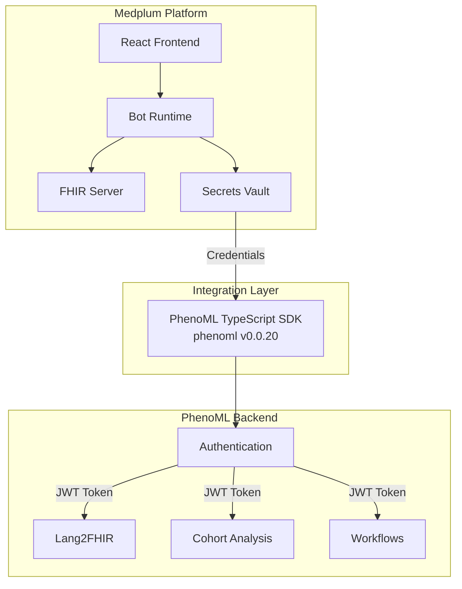
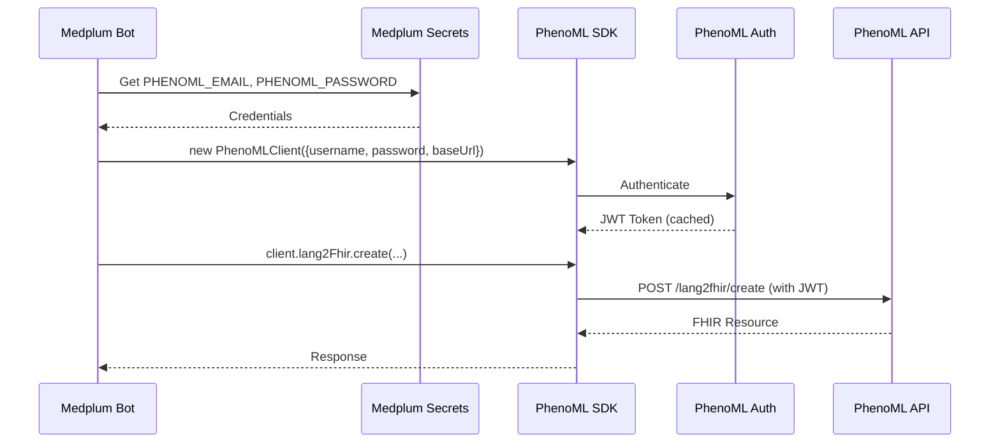
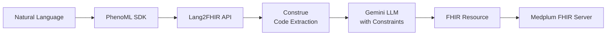
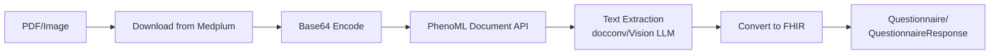
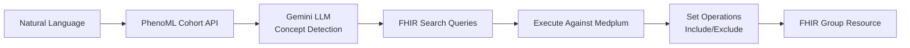
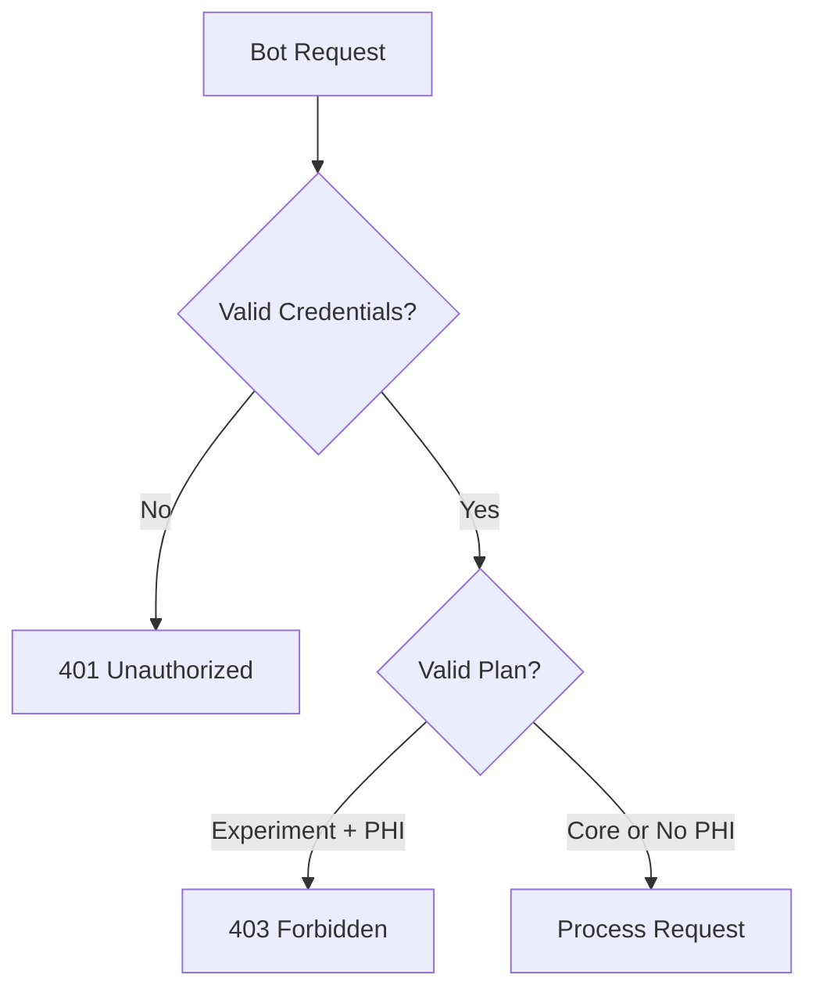

# PhenoML and Medplum Integration

Deep dive into how PhenoML and Medplum work together to enable AI-powered healthcare charting.

## Integration Overview



## How the Systems Connect

### Bot-Based Architecture

The integration uses Medplum bots as the bridge between the two systems:

1. **Frontend** triggers bot execution with user input
2. **Bot** retrieves PhenoML credentials from Medplum secrets
3. **Bot** initializes PhenoML SDK and calls APIs
4. **PhenoML** processes request using Gemini LLM
5. **Bot** returns structured FHIR resources to frontend
6. **Frontend** saves resources to Medplum FHIR server

### The 5 Integration Bots

| Bot | PhenoML API | Purpose |
|-----|-------------|---------|
| `lang2fhir-create.ts` | `client.lang2Fhir.create()` | Text to FHIR resources |
| `lang2fhir-document.ts` | `client.lang2Fhir.document()` | Documents to FHIR |
| `phenoml-cohort.ts` | `client.cohort.analyze()` | Cohort queries |
| `phenoml-workflow.ts` | `client.workflows.execute()` | Workflow execution |
| `clinical-trials-bot.ts` | Direct Gemini | Trial analysis |

## Authentication Flow



### Credential Configuration

Credentials are stored in Medplum's encrypted secrets vault:

```typescript
// In bot code
const email = event.secrets['PHENOML_EMAIL']?.valueString;
const password = event.secrets['PHENOML_PASSWORD']?.valueString;

const client = new PhenoMLClient({
  username: email,
  password,
  baseUrl: 'https://experiment.app.pheno.ml',
});
```

### Environment URLs

| Environment | URL | Usage |
|-------------|-----|-------|
| Experiment | `https://experiment.app.pheno.ml` | Development, testing |
| Production | `https://app.pheno.ml` | Production, PHI data |

## PhenoML SDK Usage

### Installation

The SDK is included as a dependency:

```json
{
  "dependencies": {
    "phenoml": "^0.0.20"
  }
}
```

### SDK Methods

#### 1. Lang2FHIR Create

Convert natural language text to FHIR resources:

```typescript
import { PhenoMLClient } from 'phenoml';

const client = new PhenoMLClient({
  username: email,
  password,
  baseUrl: 'https://experiment.app.pheno.ml',
});

const resource = await client.lang2Fhir.create({
  version: 'R4',
  resource: 'simple-observation',  // or 'condition', 'procedure', etc.
  text: 'Patient has blood pressure of 120/80 mmHg',
});
```

**Supported Resource Types:**

| SDK Resource Name | FHIR Resource |
|-------------------|---------------|
| `simple-observation` | Observation |
| `condition-encounter-diagnosis` | Condition |
| `procedure` | Procedure |
| `medicationrequest` | MedicationRequest |
| `careplan` | CarePlan |
| `plandefinition` | PlanDefinition |
| `questionnaire` | Questionnaire |
| `questionnaire-response` | QuestionnaireResponse |
| `researchstudy` | ResearchStudy |

#### 2. Lang2FHIR Document

Process documents (PDF, images) into FHIR resources:

```typescript
const resource = await client.lang2Fhir.document({
  version: 'R4',
  resource: 'questionnaire',  // or 'questionnaire-response'
  content: base64EncodedContent,
  fileType: 'application/pdf',  // or 'image/png', 'image/jpeg'
});
```

**Supported File Types:**

| MIME Type | Extension |
|-----------|-----------|
| `application/pdf` | .pdf |
| `image/png` | .png |
| `image/jpeg` | .jpg, .jpeg |

#### 3. Cohort Analysis

Convert natural language to FHIR search queries:

```typescript
const response = await client.cohort.analyze({
  text: 'Female patients over 40 with diabetes but not hypertension',
  include_extract_results: true,
  include_rationale: true,
  exclude_deceased: true,
});

// Response structure
interface CohortResponse {
  success: boolean;
  message: string;
  queries: Array<{
    resource_type: 'Patient' | 'Condition' | 'Observation' | 'Procedure';
    search_params: string;  // FHIR search parameters
    concept: string;        // Original concept text
    exclude: boolean;       // Include or exclude from cohort
  }>;
}
```

**Example Response:**
```json
{
  "success": true,
  "message": "Generated 3 search queries",
  "queries": [
    {
      "resource_type": "Patient",
      "search_params": "gender=female&birthdate=lt1984-01-01",
      "concept": "female patients over 40",
      "exclude": false
    },
    {
      "resource_type": "Condition",
      "search_params": "code=E11",
      "concept": "diabetes",
      "exclude": false
    },
    {
      "resource_type": "Condition",
      "search_params": "code=I10",
      "concept": "hypertension",
      "exclude": true
    }
  ]
}
```

#### 4. Workflow Execution

Execute PhenoML workflows:

```typescript
const result = await client.workflows.execute(workflowId, {
  input_data: {
    patientId: 'Patient/123',
    // ... workflow-specific input
  },
});
```

## Data Transformation Patterns

### Pattern 1: Text to FHIR



**Key Feature: Constraint-Based Generation**

PhenoML uses a constraint-based approach to ensure valid FHIR output:

1. **Construe Module** extracts valid medical codes from text
2. **Gemini Schema** is constrained to only use extracted codes
3. **Result** is always valid FHIR with real medical codes

This prevents LLM hallucination of invalid codes.

### Pattern 2: Document Processing



### Pattern 3: Cohort Query Translation



## Bot Implementation Examples

### Lang2FHIR Create Bot

```typescript
// src/bots/lang2fhir-create.ts
import { BotEvent, MedplumClient } from '@medplum/core';
import { PhenoMLClient } from 'phenoml';

export async function handler(
  medplum: MedplumClient,
  event: BotEvent
): Promise<any> {
  // Get credentials from Medplum secrets
  const email = event.secrets['PHENOML_EMAIL']?.valueString;
  const password = event.secrets['PHENOML_PASSWORD']?.valueString;

  if (!email || !password) {
    throw new Error('PhenoML credentials not configured');
  }

  // Initialize PhenoML client
  const client = new PhenoMLClient({
    username: email,
    password,
    baseUrl: 'https://experiment.app.pheno.ml',
  });

  // Get input from bot event
  const { text, resourceType, patient } = event.input;

  // Map resource type to PhenoML profile
  const profileMap: Record<string, string> = {
    'observation': 'simple-observation',
    'condition': 'condition-encounter-diagnosis',
    'procedure': 'procedure',
    'medicationrequest': 'medicationrequest',
  };

  const profile = profileMap[resourceType.toLowerCase()];

  // Call PhenoML API
  const resource = await client.lang2Fhir.create({
    version: 'R4',
    resource: profile,
    text,
  });

  // Add patient reference if provided
  if (patient && resource) {
    resource.subject = { reference: `Patient/${patient}` };
  }

  return resource;
}
```

### Cohort Bot

```typescript
// src/bots/phenoml-cohort.ts
import { BotEvent, MedplumClient } from '@medplum/core';
import { PhenoMLClient } from 'phenoml';
import { Group, Patient } from '@medplum/fhirtypes';

export async function handler(
  medplum: MedplumClient,
  event: BotEvent
): Promise<Group> {
  const { text, config } = event.input;

  // Initialize PhenoML client
  const client = new PhenoMLClient({
    username: event.secrets['PHENOML_EMAIL']?.valueString,
    password: event.secrets['PHENOML_PASSWORD']?.valueString,
    baseUrl: 'https://experiment.app.pheno.ml',
  });

  // Get cohort queries from PhenoML
  const cohortResponse = await client.cohort.analyze({
    text,
    exclude_deceased: config?.excludeDeceased ?? true,
  });

  // Execute queries against Medplum
  let includedPatients = new Set<string>();
  let excludedPatients = new Set<string>();

  for (const query of cohortResponse.queries) {
    const results = await medplum.searchResources(
      query.resource_type,
      query.search_params
    );

    const patientIds = extractPatientIds(results);

    if (query.exclude) {
      patientIds.forEach(id => excludedPatients.add(id));
    } else {
      if (includedPatients.size === 0) {
        patientIds.forEach(id => includedPatients.add(id));
      } else {
        // Intersection
        includedPatients = new Set(
          [...includedPatients].filter(id => patientIds.has(id))
        );
      }
    }
  }

  // Remove excluded patients
  excludedPatients.forEach(id => includedPatients.delete(id));

  // Create FHIR Group
  const group: Group = {
    resourceType: 'Group',
    type: 'person',
    actual: true,
    name: `Cohort: ${text}`,
    member: [...includedPatients].map(id => ({
      entity: { reference: `Patient/${id}` },
    })),
  };

  return group;
}
```

## Security Considerations

### Credential Management

| Practice | Implementation |
|----------|----------------|
| **Encrypted Storage** | Credentials stored in Medplum's encrypted secrets vault |
| **No Logging** | Credentials never logged or exposed in responses |
| **Bot Isolation** | Each bot execution has isolated access to secrets |
| **HTTPS Only** | All API communication over TLS |

### PHI Handling

| Environment | PHI Allowed | Use Case |
|-------------|-------------|----------|
| Experiment | No | Development, testing, demos |
| Core/Production | Yes | Clinical production use |

### API Access Control



## Error Handling

### Common Errors

| Error | Cause | Solution |
|-------|-------|----------|
| `401 Unauthorized` | Invalid credentials | Check PHENOML_EMAIL/PASSWORD secrets |
| `403 Forbidden` | Plan restriction | Upgrade to Core plan for PHI |
| `400 Bad Request` | Invalid input | Check text and resourceType parameters |
| `500 Server Error` | LLM failure | Retry; check PhenoML status |

### Bot Error Handling Pattern

```typescript
try {
  const resource = await client.lang2Fhir.create({...});
  return { success: true, resource };
} catch (error) {
  if (error.status === 401) {
    throw new Error('PhenoML credentials invalid or expired');
  }
  if (error.status === 403) {
    throw new Error('PhenoML plan does not support this operation');
  }
  throw new Error(`PhenoML API error: ${error.message}`);
}
```

## Performance Considerations

### Latency Sources

| Operation | Typical Latency |
|-----------|-----------------|
| Bot startup (Lambda cold start) | 100-500ms |
| PhenoML authentication | 50-100ms (cached) |
| Lang2FHIR text processing | 500ms-2s |
| Document processing | 2-5s (depends on size) |
| Cohort analysis | 500ms-1s |

### Optimization Tips

1. **Batch Operations** - Use `lang2fhir/create/multi` for multiple resources
2. **Cache Patient Context** - Avoid re-fetching patient data
3. **Debounce UI Updates** - Frontend uses 100ms debounce for auto-save

## Related Documentation

- [ARCHITECTURE.md](./ARCHITECTURE.md) - System architecture
- [PHENOML_APIS.md](./PHENOML_APIS.md) - PhenoML API reference
- [BOTS.md](./BOTS.md) - Bot system documentation
- [DATA_FLOWS.md](./DATA_FLOWS.md) - Detailed data flows
