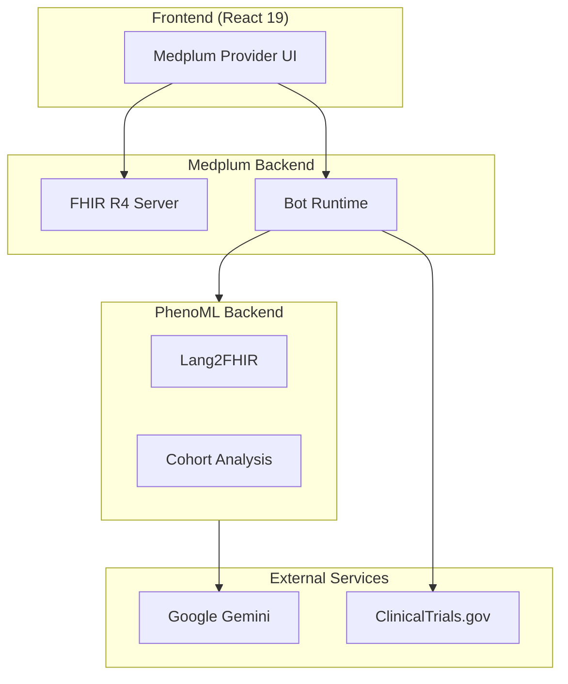

# Medplum Provider with Lang2FHIR Documentation

AI-powered healthcare charting application that leverages PhenoML's Lang2FHIR API to convert natural language into structured FHIR resources.

## What This Application Does

This is an **AI-Powered Healthcare Charting Application** designed for healthcare providers to:

- **Create FHIR resources using natural language** - Convert spoken or written clinical text directly into structured medical records
- **Process medical documents** - Upload PDFs and images, automatically extract information into FHIR Questionnaires
- **Find clinical trials** - Search ClinicalTrials.gov and get AI-powered eligibility analysis for patients
- **Define patient cohorts** - Use natural language to identify patient populations (e.g., "female patients over 40 with diabetes")
- **Execute custom workflows** - Run PhenoML workflows for complex clinical decision support

## Technology Stack

| Layer | Technology |
|-------|-----------|
| **Frontend** | React 19, Vite, Mantine UI, React Router |
| **FHIR Client** | @medplum/react, @medplum/core |
| **Backend** | Medplum (FHIR R4 Server) |
| **Automation** | Medplum Bots (AWS Lambda / vmcontext) |
| **AI/NLP** | PhenoML SDK, Google Gemini, Whisper (speech-to-text) |
| **External APIs** | ClinicalTrials.gov, PhenoML Backend |
| **Language** | TypeScript |

## Documentation

| Document | Description |
|----------|-------------|
| [LOCAL_SETUP.md](./LOCAL_SETUP.md) | Complete guide to running the application locally |
| [ARCHITECTURE.md](./ARCHITECTURE.md) | System architecture and component overview |
| [PHENOML_INTEGRATION.md](./PHENOML_INTEGRATION.md) | How PhenoML and Medplum work together |
| [PHENOML_APIS.md](./PHENOML_APIS.md) | PhenoML backend API reference |
| [BOTS.md](./BOTS.md) | Medplum bot system documentation |
| [DATA_FLOWS.md](./DATA_FLOWS.md) | Detailed data flow diagrams |
| [HOW_BOTS_WORK.md](./HOW_BOTS_WORK.md) | Practical guide to how bots function |
| [BOT_VS_AGENT.md](./BOT_VS_AGENT.md) | Comparison of bot-based vs agent-based architectures |

## Quick Start

```bash
# 1. Clone and install
git clone https://github.com/PhenoML/medplum-provider-lang2fhir.git
cd medplum-provider-lang2fhir
npm install

# 2. Configure (see LOCAL_SETUP.md for details)
# - Edit src/main.tsx for Medplum connection
# - Edit src/scripts/deploy-bots.ts for bot runtime

# 3. Start development server
npm run dev

# 4. Open browser
# http://localhost:3000

# 5. Set PhenoML secrets in Medplum Admin
# Admin → Project → Secrets
# Add: PHENOML_EMAIL and PHENOML_PASSWORD
```

See [LOCAL_SETUP.md](./LOCAL_SETUP.md) for complete setup instructions.

## Architecture Overview



See [ARCHITECTURE.md](./ARCHITECTURE.md) for detailed architecture documentation.

## Key Features

### 1. Natural Language to FHIR
Convert clinical text like "Patient has blood pressure of 120/80 mmHg" into structured FHIR Observation resources.

### 2. Document Processing
Upload PDF forms or images and automatically extract structured data into FHIR Questionnaires.

### 3. Patient Cohort Creation
Describe patient populations in natural language: "Female patients over 40 with diabetes but not hypertension" and get a FHIR Group resource.

### 4. Clinical Trials Search
Find matching clinical trials from ClinicalTrials.gov with AI-powered eligibility analysis using Google Gemini.

### 5. Voice Input
Use Whisper (browser-local) for speech-to-text transcription during charting.

## License

See repository for license information.
